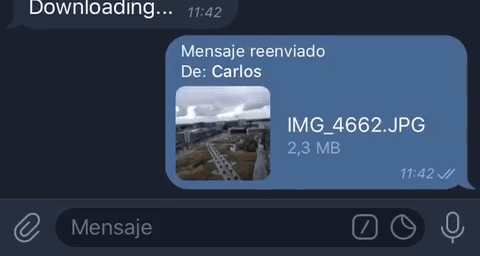

# TG Media Downloader Bot 🤖

A telegram bot based on [Pyrogram](https://github.com/pyrogram/pyrogram) that downloads on a local storage the following media files: _animation, audio, document, photo, video, voice_.

_The bot is inspired from the [Telethon-based](https://github.com/rodriguezst/telethon_downloader) bot by [rodriguezst](https://github.com/rodriguezst)._

- [TG Media Downloader Bot 🤖](#tg-media-downloader-bot-)
  - [TO-DO](#to-do)
  - [Why should I use a MTProto bot? 🧐](#why-should-i-use-a-mtproto-bot-)
  - [How to use 🧠](#how-to-use-)
  - [Setup ⚙️](#setup-️)
    - [Docker 🐋](#docker-)
    - [Barebone 🖥️](#barebone-️)
  - [Generating Telegram API keys](#generating-telegram-api-keys)
  - [Creating a Telegram Bot](#creating-a-telegram-bot)
  - [Support](#support)
  - [:warning: License](#warning-license)

## TO-DO

   - [x] It runs
   - [x] It downloads supported media
   - [x] Use a fallback for missing metadata
   - [x] Allow custom names for un-named files instead of file_unique_id
   - [ ] Improve error handling related to Telegram's service

## Why should I use a MTProto bot? 🧐

   MTProto clients connect directly to Telegram’s servers, which means there is no HTTP connection, no “polling” or “web hooks”. This means less overhead, since the protocol used between you and the server is much more compact than HTTP requests with responses in wasteful JSON.

   Since there is a direct connection to Telegram’s servers, even if their Bot API endpoint is down, you can still have connection to Telegram directly.

   Using a MTProto client, you are also not limited to the public API that they expose, and instead, you have full control of what your bot can do.

   __HTTP Bots can't download file bigger than 10mb meanwhile MTProto can download files of 1.5~2GB!__

## How to use 🧠

After the setup the bot is ready to use, send/forward any supported media to the bot to download on local storage.

The bot supports the following commands:
| Command   | Role                                                                                           |
| --------- | ---------------------------------------------------------------------------------------------- |
| `/start`  | Initial command (invoked by Telegram) when you start the chat with the bot for the first time. |
| `/help`   | Gives you the available commands list.                                                         |
| `/about`  | Gives you information about the project.                                                       |
| `/abort`  | Cancel all the pending downloads.                                                              |
| `/status` | Gives you the current configuration.                                                           |
| `/usage`  | Gives you the usage instructions.                                                              |

## Setup ⚙️

The bot requires the following env-vars o work properly:

| Variable Name                  | Role                                                                                                                                                               |
| ------------------------------ | ------------------------------------------------------------------------------------------------------------------------------------------------------------------ |
| __TG_API_ID__                  | Telegram API ID obtained via developer settings (see [here](#generating-telegram-api-keys))                                                                        |
| __TG_API_HASH__                | Telegram API HASH obtained via developer settings (see [here](#generating-telegram-api-keys))                                                                      |
| __TG_BOT_TOKEN__               | Telegram Bot Token obtained via BotFather (see [here](#creating-a-telegram-bot))                                                                                   |
| __TG_MAX_PARALLEL__ [OPTIONAL] | Maximum number of parallel downloads allowed (default: 4)  _A big number can cause flood bocks_                                                                 |
| __TG_DL_TIMEOUT__ [OPTIONAL]   | Maximum time (in seconds) to wait for a download to complete (default: 5400) _In case of timeout the download is aborted and a error is triggered_              |
| __TG_DOWNLOAD_PATH__           | Download folder on the local storage/docker mount where the files will be downloaded _The files will appear inside the folder only after download completation_ |
| __TG_AUTHORIZED_USER_ID__      | List separated by comma of authorized users' id, you can get them using the [userinfobot](https://github.com/nadam/userinfobot)  _It can't be empty_            |

You can run the bot inside a Docker container or directly on your PC/Server OS.

### Docker 🐋

 If you want to containerize the bot, just pull or build a image and provide the requires env-vars.

 _Make sure that the download path is a mounted as a volume to allow the host system to access the downloaded files._

### Barebone 🖥️

   If you want to run the bot directly on your PC/Server OS, do the following:

   0) Make sure to have Python 3.6+ installed on your system;
   1) Create a folder anywhere on your pc and clone the repository there:

      `git clone https://github.com/LightDestory/TG_MediaDownloader`

   2) Install the requirements using pip:

      `pip install -r requirements.txt`

   3) Execute the bot and follow the wizard to provide the env-vars:

      `python ./tg_downloader.py`

## Generating Telegram API keys

Before working with Telegram's API, you need to get your own API ID and hash:

1. Go to [My Telegram](https://my.telegram.org/) and login with your phone number;
2. Click under API Development tools;
3. A _Create new application_ window will appear. Fill in your application details. There is no need to enter any _URL_, and only the first two fields (_App title_ and _Short name_) can currently be changed later;
4. Click on _Create application_ at the end. Remember that your __API ID and API Hash are secrets__ and Telegram won't let you revoke it. __Don't post it anywhere!__

## Creating a Telegram Bot

1. Open a conversation with [@BotFather](https://telegram.me/botfather) in Telegram
2. Use the /newbot command to create a new bot. The BotFather will ask you for a name and username, then generate an authorization token for your new bot.

   * The name of your bot is displayed in contact details and elsewhere.
   * The Username is a short name, to be used in mentions and telegram.me links. Usernames are 5-32   characters long and are case-insensitive, but may only include Latin characters, numbers, and underscores. Your bot`s username must end in ‘bot’, e.g. ‘tetris_bot’ or ‘TetrisBot’.
   * The token is a string along the lines of 110201543:AAHdqTcvCH1vGWJxfSeofSAs0K5PALDsaw that is required to authorize the bot and send requests to the Bot API. Keep your token secure and store it safely, it can be used by anyone to control your bot.

## Support

    

## :warning: License

This collection is under GNU GPL-3.0 License.